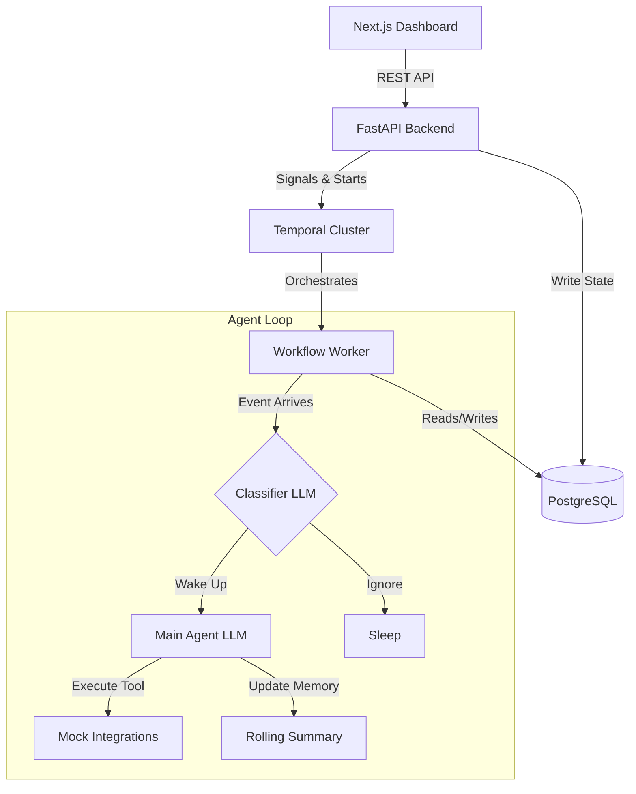
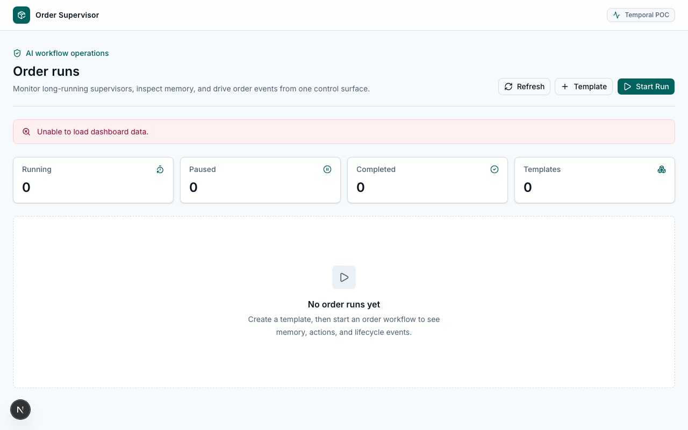

# AI Order Supervisor

> A production-grade, event-driven AI agent that oversees a single e-commerce order from creation to completion — built with Temporal, FastAPI, Next.js, PostgreSQL, and Ollama.

---

## 📖 Project Overview

In standard e-commerce systems, long-running processes like order fulfillment span days or weeks. When exceptions occur (payment failures, shipping delays), human support agents must manually intervene, coordinate across systems, and update the customer. This manual intervention is slow, expensive, and prone to human error.

The **Order Supervisor** solves this by assigning a dedicated AI agent to oversee every single order. The agent monitors the order's state, proactively detects anomalies, executes remedial business actions, and coordinates systems without human involvement unless explicitly escalated.

---

## 🏗️ Architecture



### Technology Stack
- **Frontend:** Next.js 14, Tailwind CSS, shadcn/ui
- **Backend:** FastAPI, Pydantic, SQLAlchemy
- **Orchestration:** Temporal Python SDK
- **Database:** PostgreSQL (with asyncpg and Alembic)
- **AI/LLM:** Ollama (Llama 3), interchangeable with OpenAI/Gemini

---

## 📁 Folder Structure

```text
.
├── backend/
│   ├── activities/     # Temporal Activities (LLM logic, DB writes)
│   ├── agent/          # LLM Prompts, Classifier Logic, Provider Abstractions
│   ├── api/            # FastAPI Routes & Dependencies
│   ├── database/       # SQLAlchemy Models & Sessions
│   ├── schemas/        # Pydantic validation models
│   └── temporal/       # Core Temporal Workflow logic
├── frontend/
│   ├── src/app/        # Next.js Pages & Layouts
│   └── src/components/ # React UI Components
└── docs/               # Technical Documentation & Architecture Deep-Dives
```

---

## 🚀 Setup Instructions

### Prerequisites
- Python 3.11+
- Node.js 18+
- Docker & Docker Compose
- Temporal CLI (`brew install temporal`)
- Ollama (installed locally and running `ollama run llama3`)

### 1. Environment Variables
Copy the template configuration:
```bash
cp .env.example .env
```
Ensure `OLLAMA_BASE_URL` is pointing to your local instance.

### 2. Infrastructure (Docker)
Start the PostgreSQL database and the Temporal Server:
```bash
docker compose up -d postgres
temporal server start-dev --headless
```

### 3. Backend API & Worker
In a new terminal pane, set up the Python environment, apply DB migrations, and start the API:
```bash
cd backend
python -m venv venv && source venv/bin/activate
pip install -r requirements.txt
alembic upgrade head
uvicorn api.main:app --reload --port 8000
```
In *another* terminal pane, start the Temporal Worker:
```bash
cd backend
source venv/bin/activate
python worker/main.py
```

### 4. Frontend UI
In a final terminal pane, start the Next.js server:
```bash
cd frontend
npm install
npm run dev
```
Open **http://localhost:3000** in your browser.

---

## 🛠️ API Overview

- `POST /api/runs`: Starts a new Temporal Workflow for an `order_id` and `tenant_id`.
- `GET /api/runs`: Returns the current state of all active and completed runs from the database.
- `POST /api/runs/{run_id}/events`: Injects an asynchronous event (e.g., `payment_failed`) as a Temporal signal into a running workflow.
- `POST /api/runs/{run_id}/instructions`: Sends a manual human-in-the-loop instruction to the agent.
- `POST /api/runs/{run_id}/kill`: Sends a termination signal to elegantly kill the workflow.

---

## 🧠 Temporal Workflow Overview

The core engine is `OrderSupervisorWorkflow`. Once started, it enters an infinite `while` loop:
1. **Sleep Phase:** Suspends execution (`wait_condition`) using zero CPU until an event arrives or a timer fires.
2. **Classifier Phase:** On wake, a cheap LLM classifier evaluates new events against the current memory. If the events are routine, the agent goes back to sleep.
3. **Agent Phase:** If intervention is required, the main LLM reasons about the state, executes tools, updates the rolling memory summary, and sets a new sleep timer.
4. **Compaction:** Every 100 loops, the workflow calls `continue_as_new` to cleanly truncate its history and start fresh, ensuring it can theoretically run for decades without hitting Temporal memory limits.

---

## 🖼️ Screenshots

| Dashboard | Run Simulator |
| :---: | :---: |
|  |  |

---

## 🤔 Design Decisions & Trade-offs

- **Polling vs. WebSockets:** The UI currently polls the backend every 3 seconds for state updates. While WebSockets (via Redis pub/sub) would provide true real-time streaming, polling drastically simplifies local deployment and containerization for this prototype.
- **Fail-Open LLMs:** If the LLM provider times out or returns malformed JSON, the classifier defaults to `should_wake=True` to prevent dropping critical events. If the main agent fails after exhausting retries, it gracefully falls back to a 5-minute sleep rather than crashing the workflow.
- **Event Sourcing:** We store a chronological `ActivityLog` in Postgres rather than mutating a single row. This enables the UI to render a perfect timeline of agent decisions.

For a deeper dive, read the full [Architecture Decisions](docs/interview/ARCHITECTURE_DECISIONS.md) document.

---

## 🧪 Testing & Demo Instructions

To run the backend test suite:
```bash
cd backend
pytest tests/
```

To run a demonstration:
1. Open the UI at `localhost:3000`.
2. Click **Start New Run**.
3. Use the **Inject Event** dropdown to simulate a `payment_failed` scenario.
4. Observe the timeline as the workflow wakes up, the classifier evaluates the event, the main agent executes the `message_customer` tool, and the system goes back to sleep.
5. Inject a `delivered` event to gracefully complete the workflow.
